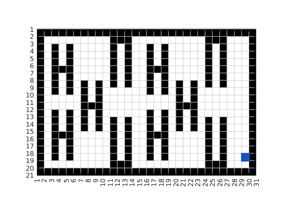
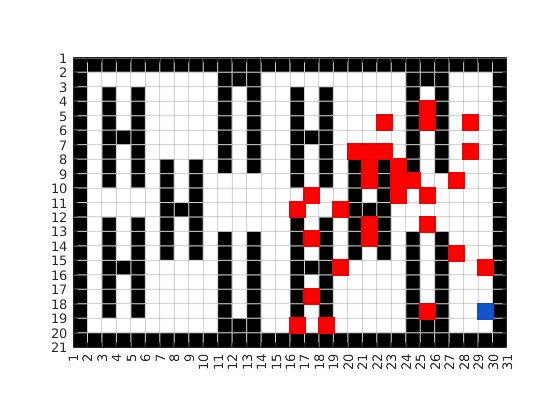
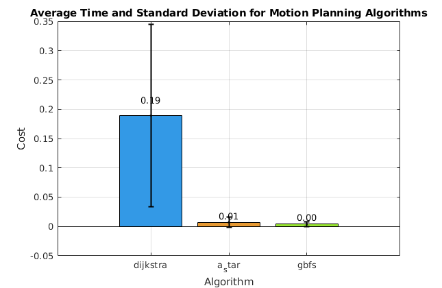
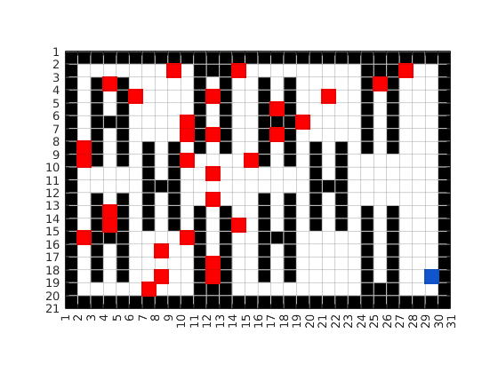
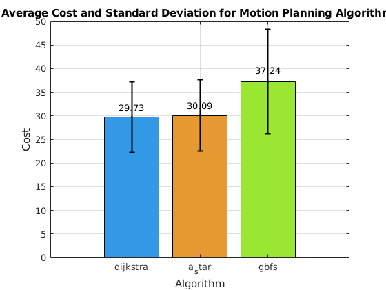
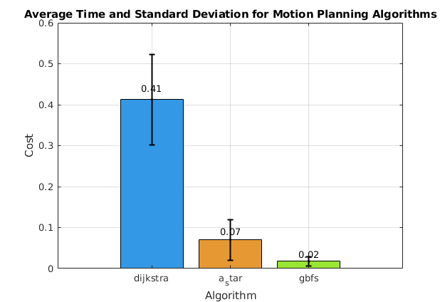
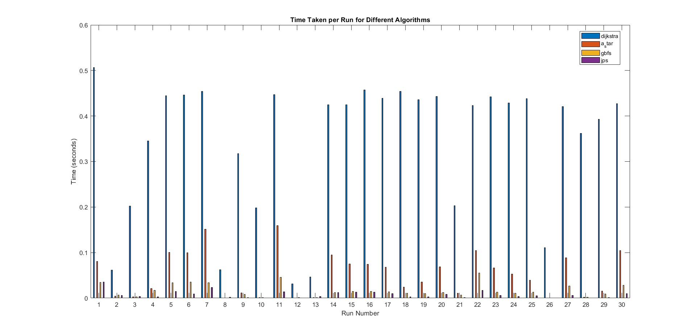
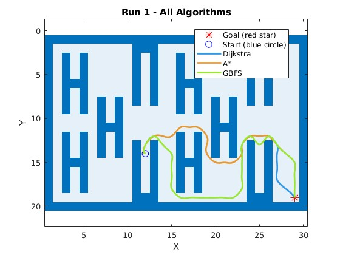
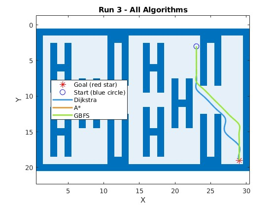
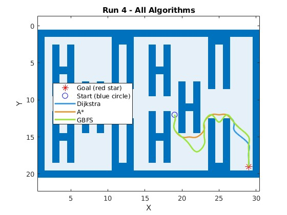

# Scenario Description: Robot Path Planning in a Warehouse
We have a warehouse robot which is tasked with fetching items from any shelf in the warehouse and bringing them to a conveyor belt for packaging. This means that the start and endpoint of every fetch is the same. To simplify the model we can say that we only go oneway: from the shelf to the drop off point.

For this purpose, we compare three different path-planning algorithms: **Dijkstra**, **A\***, and **Greedy Best-First Search (GBFS)**. 
These algorithms are tested under different conditions and evaluated based on key metrics such as time to compute the path and path length.

## Motivation and Goal

The goal of this study is to improve the operational efficiency of warehouse robots by determining the most suitable path-planning algorithm. 
We aim to identify the algorithm that minimizes transportation costs, which means the length of the path and the time to compute it 

## Hypothesis

We hypothesize that each algorithm will perform differently depending on the scenario. 
Dijkstra's algorithm, known for finding the shortest path, is likely to incur higher computational costs, whereas A\* is expected to offer a balance between computational efficiency and path optimality. 
GBFS is faster in some cases but may result in less optimal paths.

## Tools and Algorithms

The study employs a simulated warehouse environment represented as a grid map. The algorithms under comparison include:

- **Dijkstra's Algorithm**: A well-known graph-based algorithm that guarantees finding the shortest path but may be computationally expensive for larger grids.
- **A\* Algorithm**: An efficient algorithm that combines Dijkstra's approach with heuristic-based search, achieving faster computation while maintaining near-optimal path solutions.
- **Greedy Best-First Search (GBFS)**: A faster heuristic algorithm that sacrifices some path optimality for speed, especially in environments with fewer obstacles.

The algorithms are implemented in MATLAB, and custom functions are used to visualize the grid, obstacles, and paths taken by the robot.

## Setup and Parameter Selection

The environment is a grid-based warehouse layout with varying storage and obstacle placements. Random start and goal points are selected for each run, ensuring fair comparison across algorithms. The key parameters examined include:

- **Path length**: Number of grid squares traveled by the robot.
- **Computation Time**: Total time to execute the algorithm

## Statistical Tools
We indentify the average and standard deviation for all of our algorithms.

---

# Path Length Comparison for Different Algorithms

## The Setup
The performance of **Dijkstra**, **A\***, and **GBFS** algorithms was evaluated in our virtual Warehouse. 
\
Where the blue square is the drop off location and the black squares are the shelves and walls.\
We then did two sets of runs. One with close targets and one with far targets.

## Run Sets
### Run Set 1
In the first Run Set we performed 30 fetches wich were up to 15 length units away from our drop off point.\
\
We executed all three algorithms on these 30 pickup points and recorded the length of their path as well as their time to calculate it.
#### Analysis
\
In this path length comparison we see the bars which indicate the average path length for this algorithm for all 30 runs. The error bars show the standard deviation.\
We can see, that dijkstra and a* arrived at very similar values, while gbfs selects longer paths on average. It is also noteworthy, that gbfs has a lot higher variability in its results.\
For us this means, that both, dijkstra as well as a* seem feasible for now, while gbfs does not seem like a good fit.\
\
In this graph we can see the average measured time to compute the path for the 30 start points. The error bars again show the standard deviation in this set.\
It is easy to see, that dijkstra takes by far the longest to compute and has the highes variability in its computation times. Whilst A* and GBFS are similar, GBFS is faster on average.\
This means for us, that A* is the preferred algorithm due to its similar performance in path length to dijkstra, but significantly better performance in terms of time.

### Run Set 2
In the second set of runs we performed 30 more fetches from locations which were more than 15 length units away from the drop off point.\
\
We executed all three algorithms on these 30 pickup points and recorded the length of their path as well as their time to calculate it.\
\
In this path length comparison we see the bars which indicate the average path length for this algorithm for all 30 runs. The error bars show the standard deviation.\
Again we can see, that dijkstra and a* arrived at very similar values, while gbfs selects longer paths on average. \
This confirms our data from the first set of runs, although the differences are now more obvious.\
\
In this graph we can see the average measured time to compute the path for the 30 start points. The error bars again show the standard deviation in this set.\
Dijkstra again takes the longest to calculate, while A* and gbfs are close together.\
Although the relative differences between A* and Dijkstra are now significantly smaller than in the first set of runs, A* still outperforms Dijkstra.

## Visual Results (Additional Analysis)
We also visualized every run in the second set to get a better overview of the data.

### 1. Path Lengths per Run
This diagram shows the path lengths found by each algorithm for 30 different runs in the second set.

### 2. Time Taken per Run
This diagram shows the computation time taken by each algorithm for 30 different runs in the second.

### 4. Paths Visualized on the Grid Map
This image shows the paths found by each algorithm (color-coded) on the grid map for various start points. This may help to understand the working of the algorithms

---

### Final Thoughts
Algorithm | MeanPathLength | MeanTime | MeanCost
---|---|---|---
Dijkstra | 23.4 | 0.2595 | 26.126
A* | 24.033 | 0.038993 | 26.527
GBFS | 28.733 | 0.011029 |32.343 

- **A\*** proved to be the most balanced algorithm in terms of both **path length** and **time**, offering efficient paths with relatively lower computation times.
- **Dijkstra** is more suited for environments that require high path accuracy but may incur higher computational expenses.
- **GBFS** is a viable choice for simpler, obstacle-free environments where computational speed is more critical than path accuracy.
