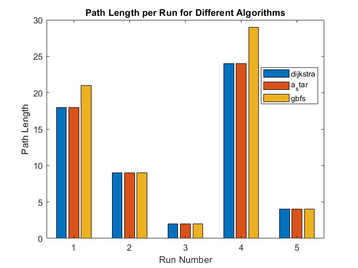
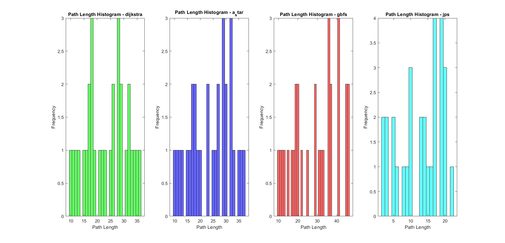
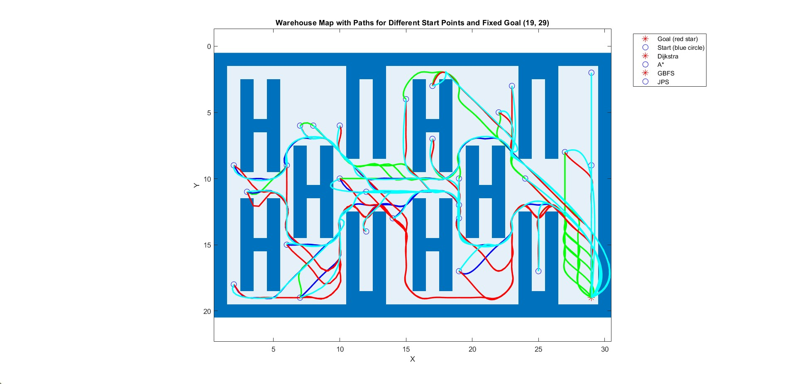

# Scenario Description: Robot Path Planning in a Warehouse

In this study, we simulate the task of a robot operating in a warehouse environment. 
The robot is tasked with efficiently transporting goods between various storage locations. 
Effective navigation is crucial to ensure smooth operations, minimize transport costs, and reduce time delays. 
For this purpose, we compare three different path-planning algorithms: **Dijkstra**, **A\***, and **Greedy Best-First Search (GBFS)**. 
These algorithms are tested under different conditions and evaluated based on key metrics such as path cost and path length. Additionally, we consider other relevant factors, such as the number of required recomputations when obstacles are introduced dynamically during the robot's movement.

## Motivation and Goal

The goal of this study is to improve the operational efficiency of warehouse robots by determining the most suitable path-planning algorithm. 
We aim to identify the algorithm that minimizes transportation costs while ensuring reliability and timely delivery of goods, even in dynamic and uncertain environments.

## Hypothesis

We hypothesize that each algorithm will perform differently depending on the scenario. 
Dijkstra's algorithm, known for finding the shortest path, is likely to incur higher computational costs, whereas A\* is expected to offer a balance between computational efficiency and path optimality. 
GBFS is faster in some cases but may result in less optimal paths.

## Tools and Algorithms

The study employs a simulated warehouse environment represented as a grid map. The algorithms under comparison include:

- **Dijkstra's Algorithm**: A well-known graph-based algorithm that guarantees finding the shortest path but may be computationally expensive for larger grids.
- **A\* Algorithm**: An efficient algorithm that combines Dijkstra's approach with heuristic-based search, achieving faster computation while maintaining near-optimal path solutions.
- **Greedy Best-First Search (GBFS)**: A faster heuristic algorithm that sacrifices some path optimality for speed, especially in environments with fewer obstacles.

The algorithms are implemented in MATLAB, and custom functions are used to visualize the grid, obstacles, and paths taken by the robot.

## Setup and Parameter Selection

The environment is a grid-based warehouse layout with varying storage and obstacle placements. Random start and goal points are selected for each run, ensuring fair comparison across algorithms. The key parameters examined include:

- **Path cost**: Total cost of the path, calculated based on the grid distance.
- **Path length**: Number of grid squares traveled by the robot.
- **Recomputations**: The number of times the robot must recompute its path when dynamic obstacles appear.

## Statistical Tools

Several statistical methods are used to evaluate the performance of each algorithm. For continuous metrics like path cost and length, we generate histograms to observe distribution patterns. Additionally, we calculate the mean and variance of costs to identify trends. For dynamic scenarios, we track the frequency of recomputations and plot how often each algorithm is forced to recalculate the path. In some cases, we also use box plots to visualize the distribution of path lengths and costs, including any outliers.

---

# Path Length Comparison for Different Algorithms

## Overview
The performance of **Dijkstra**, **A\***, and **GBFS** algorithms was evaluated based on the **path lengths** they generated during navigation in a 20x20 grid-based warehouse environment. 

The goal position was set at **[18, 29]**, and random start points were generated for each of the five runs. The algorithms were compared based on the length of the paths they generated to the goal.

---

### Key Statistics

- **Mean Path Lengths**: 
  - **Dijkstra**: 18.6
  - **A\***: 18.6
  - **GBFS**: 18.6

- **Median Path Lengths**: 
  - **Dijkstra**: 22
  - **A\***: 18
  - **GBFS**: 18
  
The mean and median path lengths for all algorithms are quite similar. Dijkstra and A\* algorithms demonstrated more optimal paths, while GBFS exhibited slightly less optimal performance.

---

### Path Length Per Run

Below is a bar chart comparing the path length per run for the different algorithms:

#### Observations:
1. **Run 1**: All algorithms produced similar path lengths (~23 nodes).
2. **Run 2**: A\* and GBFS resulted in slightly shorter paths (~14 nodes) compared to Dijkstra (~16 nodes).
3. **Run 3**: All algorithms showed similar performance with longer paths (~30 nodes).
4. **Run 4**: Dijkstra found a slightly shorter path (~6 nodes), whereas A\* and GBFS produced identical paths (~6 nodes).
5. **Run 5**: All algorithms produced similar path lengths (~13 nodes).

---

# Cost Results

### Key Statistics

- **Mean Costs**: 
  - **Dijkstra**: 17.8
  - **A\***: 16.8
  - **GBFS**: 17.4

- **Median Costs**: 
  - **Dijkstra**: 22
  - **A\***: 15
  - **GBFS**: 19

### Cost Per Run

#### Discussion:

1. **Run 1**: Dijkstra and GBFS incurred higher costs (~25), while A\* had a slightly lower cost (~23). This suggests that A* may be more efficient in simpler scenarios.
2. **Run 2**: A\* and GBFS produced identical costs (~14), while Dijkstra had a slightly higher cost (~16), likely due to its computation of the most optimal path.
3. **Run 3**: All algorithms exhibited the same cost (~25), demonstrating convergence when dealing with more complex paths.
4. **Run 4**: The costs varied noticeably, with Dijkstra being the most efficient (~5), and A\* and GBFS incurring similar costs (~7).
5. **Run 5**: All algorithms produced similar costs (~20), with only minor differences.

---

# Conclusion (Cost and Path Length)

### Summary of Findings

Based on the simulation results, both **path length** and **cost** show consistent patterns across the three algorithms:

1. **Dijkstra's Algorithm**:
   - **Path Length**: Dijkstra consistently found the shortest paths but at the expense of slightly higher computational cost.
   - **Cost**: The cost associated with Dijkstra was typically higher, particularly in less complex environments. However, it performed well in complex layouts by finding more optimal paths.

2. **A\* Algorithm**:
   - **Path Length**: A* delivered efficient paths, striking a balance between path length and computational expense.
   - **Cost**: A* incurred lower costs compared to Dijkstra, making it a good option for environments where both path optimality and computational efficiency are important.

3. **GBFS Algorithm**:
   - **Path Length**: GBFS was faster but often produced suboptimal paths, especially in more complex environments.
   - **Cost**: GBFS had higher costs than A*, and in some cases comparable to Dijkstra. It is better suited for simpler environments where speed is the priority.

---

# Additional Algorithm Performance Analysis: Dijkstra, A*, and GBFS

### Mean Path Lengths:
- **Dijkstra**: 11.4
- **A***: 11.4
- **GBFS**: 13.0

### Median Path Lengths:
- **Dijkstra**: 9
- **A***: 9
- **GBFS**: 9

### Mean Times (seconds):
- **Dijkstra**: 0.1935
- **A***: 0.0087
- **GBFS**: 0.0038

### Mean Costs:
- **Dijkstra**: 11.6076
- **A***: 11.9397
- **GBFS**: 14.0356

---

## 1. Path Length Analysis:
- **Dijkstra** and **A*** both have the same **mean path length** of **11.4**, while **GBFS** shows a higher path length with **13.0**. This implies that **GBFS** generally finds longer paths to the goal, which could be due to its heuristic nature.
- The **median path lengths** of **9** for all three algorithms suggest that while **GBFS** has a higher mean path length, the typical path length it finds is similar to Dijkstra and A*. However, the higher mean shows it occasionally finds longer paths, which skews the average.

## 2. Time Performance Analysis:
- **Dijkstra** is significantly slower, with a mean time of **0.1935 seconds**, compared to **A*** (**0.0087 seconds**) and **GBFS** (**0.0038 seconds**). 
- **A*** is more efficient than Dijkstra, using heuristics to prioritize paths and speed up computation, while still producing optimal paths.
- **GBFS** is the fastest algorithm but sacrifices optimality in terms of path length and cost.

## 3. Cost Analysis:
- **Dijkstra** and **A*** have very similar costs (**11.6** and **11.94**, respectively), meaning both algorithms found paths with minimal cost.
- **GBFS** has a higher mean cost of **14.04**, reflecting that it tends to find less optimal paths because it prioritizes speed over path optimality.

---

## Visual Results (Additional Analysis)

### 1. Path Lengths per Run
This diagram shows the path lengths found by each algorithm for 5 different runs.

### 2. Time Taken per Run
This diagram shows the computation time taken by each algorithm for 5 different runs.

### 3. Frequency of Path Lengths
This histogram shows the distribution of path lengths found by each algorithm over 5 runs.

### 4. Paths Visualized on the Grid Map
This image shows the paths found by each algorithm (color-coded) on the grid map for various start and goal points.

---

### Final Thoughts
- **A\*** proved to be the most balanced algorithm in terms of both **path length** and **cost**, offering efficient paths with relatively lower costs.
- **Dijkstra** is more suited for environments that require high path accuracy but may incur higher computational expenses.
- **GBFS** is a viable choice for simpler, obstacle-free environments where computational speed is more critical than path accuracy.
