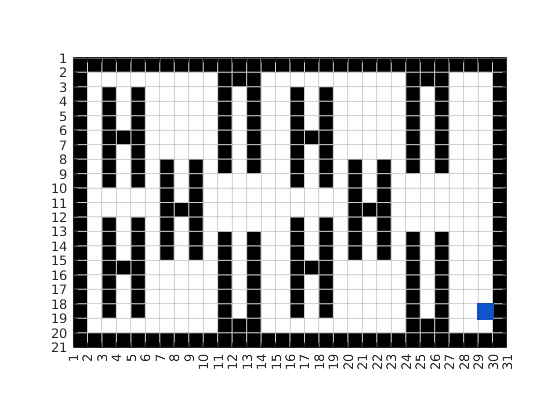
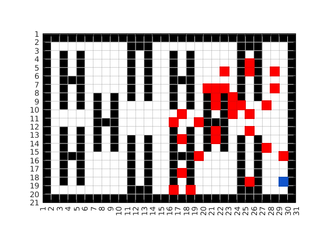
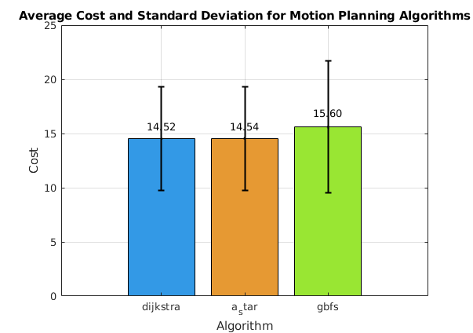
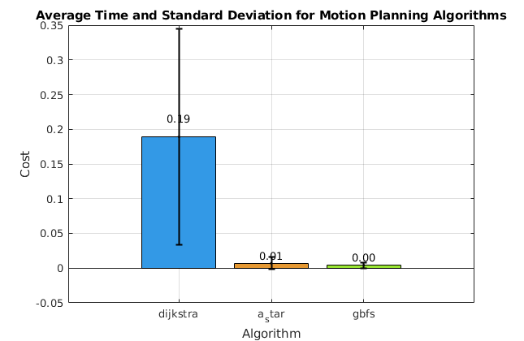
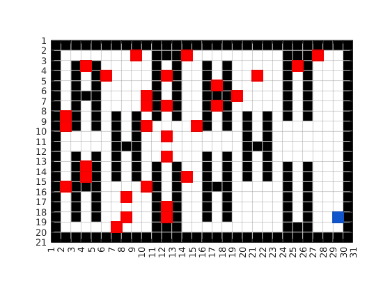
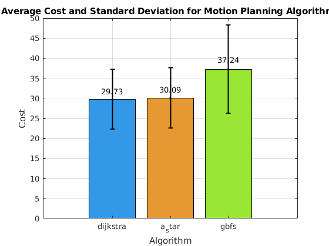
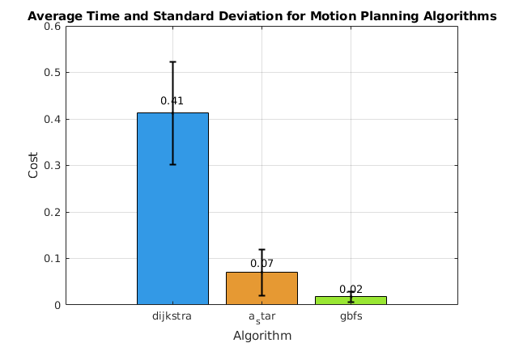

# The simulation
## Environment
Our Environment is a warehouse with shelves inside. In the following image, the drop-off point is marked with a blue square.\

## Runs
We are doing two different set of runs. The first set examines close items, which are in a distance of up to 20 units to the dropoff point. The second set of runs examines distance of more than 20 units. We do 30 runs in each set and then analyze the results
### Close Items Set
These are the pickup points which are close to the drop off area\
 

TODO: Write some analysis

### Far Items Set
These are the pickup points which are far to the drop off area\
 

TODO: Write some analysis